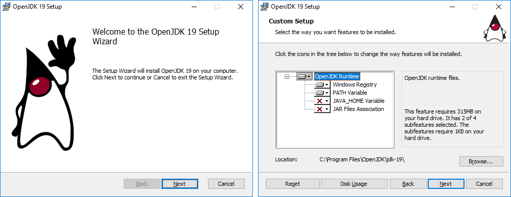

OpenJDK MSI installer for Windows
=================================

Upstream OpenJDK project currently lacks the support for packaging jdk into an installer for Windows OS.
At the same time, majority of OpenJDK vendors provide installer packages for OpenJDK distributions on Windows.

This implementation adds `make installer-msi` build target that produces a vanilla upstream MSI installer from a jdk image.
It also includes a set of examples how this vanilla installer can be extended by OpenJDK vendors.

Overview
--------

See [JEP_DRAFT.md](JEP_DRAFT.md) for details.



Goals are the following:

 - allow to build a fully functional (albeit basic) installer from upstream OpenJDK repository without requiring
 any additional scripts and resources (except the MSI build tools that need to be provided)
 - provide documentation and code examples for customizing and extending the installer with additional selectable features

The first point is targeted at "casual users" who may want to have a basic installer that they can easily rebuild if needed.

The second point is targeted at enterprise OpenJDK vendors who may want to use a vanilla installer as a "base layer"
and extend it with vendor-specific features, instead of creating their installers from scratch.
 
Implementation
--------------

See [IMPL.md](IMPL.md) for details.

MSI installers built with a [WiX toolset](https://wixtoolset.org/) are a de-facto standard for Windows installers.
This approach is used by many big open-source projects like Node.js or CMake.

Installer is created by running utilities from WiX toolset providing an XML descriptor as an input.
WiX installation detection was added to autoconf, it can detect paths to required utilities automatically based on `WIX`
environment variable (that is set by WiX installer) or from `--with-wix=c:/path/to/wix` configure flag.

XML descriptor is stored in-tree (`make/data/installermsi/jdk.xml`) in an "almost static" form (with minimal templating),
only version numbers are substituted in the descriptor during the build.

GUI forms
---------

See [GUI.md](GUI.md) for details.

WiX toolset provides a set of "standard" default GUI forms that can be personalized with images.
This implementation uses only default GUI forms. Images for it are based on OpenJDK Duke art.

Building vanilla upstream installer
-----------------------------------

See [BUILD.md](BUILD.md) for details.

The only tool, that is required in addition to usual jdk build tools, is a [WiX toolset](https://wixtoolset.org/).
When WiX is installed, it sets the `WIX` environment variable.

Configure jdk Windows build as usual and check that the following line is included in `configure` output:

```
bash configure --with-boot-jdk=...
...
checking for WiX toolset... yes, /cygdrive/c/progra~2/wixtoo~1.11/
```

Run the `installer-msi` build target:

```
make installer-msi
...
Creating jdk image
...
Creating MSI installer in /cygdrive/c/projects/openjdk/jdk/build/windows-x86_64-server-release/images/installer/msi
...
Finished building target 'installermsi' in configuration 'windows-x86_64-server-release'
```

Test coverage
-------------

See [TEST.md](TEST.md) for details.

A set of JTreg tests is included with the implementation. These tests perform actual installation/uninstallation
of the `jdk.msi`, thus they can only be run under the OS user with `Administrator` privileges.

In addition to this, `Extend*` tests (that cover the extending of a vanilla installer) perform a transformation
of `jdk.xml` descriptor and create a new extended installer packages. These tests require additional tools and resources
that need to be specified using system environment variables: `WIX`, `DENO_HOME`, `INSTALLERMSI_JAXB_EXTEND_LIBS_DIR`.
 
With these variable set, the whole test suite can be run with:
 
```
make run-test TEST=jdk/installermsi JTREG="JOBS=1"
...
Test results: passed: 10
``` 

Extending the installer
-----------------------

See [extend/README.md](../extend/README.md) for details.

OpenJDK vendors may want to use a vanilla installer as a "base layer" and extend it with vendor-specific features,
instead of creating their installers from scratch. Vendors can take the vanilla installer XML descriptor (`jdk.xml`)
and transform it changing the labels and adding new component/features.

Three different transform examples are included with the implementation (in `test/jdk/installermsi/extend` directory),
all examples are functionally equivalent (produce the same modified MSI):

 - `ExtendDom.java`: XML is loaded as a DOM tree and then transformed using `org.w3c.dom` API
 - `ExtendJaxb.java`: XML is loaded as a strongly-typed JAXB-generated object
 - `ExtendScript.js`: XML is loaded as a JavaScript object
